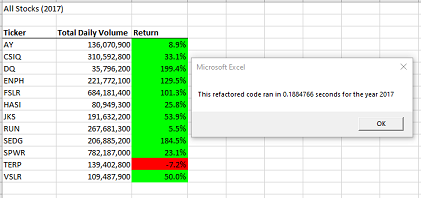
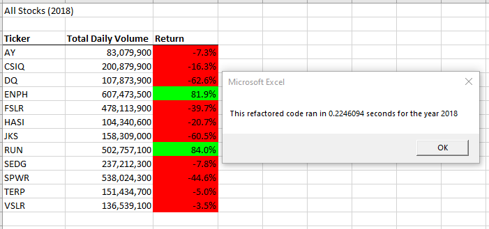

# Refactor VBA Code and Performance Analysis

## Overview of Project - Purpose - The purpose and background are well defined
Reviewing an existing VBA solution an refactoring the code to achieve speed improvements. Our client, Steve, is looking to increase the size of the dataset considerably. As such, a speed execution analysis will also be conducted to confirm that our code is more robust.

To take an existing solution that works reasonably well on a small dataset and rewrite the code to make it faster and more robust if given a much larger dataset. 

## Analysis of Solution
- How does the code work, how was it refactored

## Results - The analysis is well described with screenshots and code
- Using images and examples of your code, compare the stock performance between 2017 and 2018, as well as the execution times of the original script and the refactored script.

  

  

## Summary

- There is a detailed statement on the advantages and disadvantages of refactoring code in general?
  

- There is a detailed statement on the advantages and disadvantages of the original and refactored VBA script

