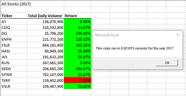
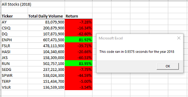

# Stock Research Analysis

## Background
Steve, our client, has recently graduated with his finance degree and his parents have agreed to be his first clients.They are very passionate about green energy and the many different energy alternates available to replace fossil fuels. However, they have a narrow understanding of the different investible companies available that align with their investment philosophy and can help them with their investment goals. Steve has agreed to perform analyses on different green energy companies as he is concerned about having suitable diversification in the their portfolio. As such, a solution was prepared for Steve that allows him to perform these analyses on the desired green energy companies and provide feeback to his parents. At this time, Steve would like to revist this existing solution to include the entire stock market over a number of years.

## Purpose
Steve has been using a VBA coded solution that has allowed him to run analyses with many different stocks. Thhis existing solution is reusable and allows him to reduce the chance of accidents and errors when performing reliable analyses.

In order to meet this new requirement we need to look at refactoring the VBA code to make it more robust and faster in order to execute the expanded dataset within a reasonable amount of time. We can also perform comparative testing on the old and any new refactored solution that is designed.

### Code Review and Analysis

After reviewing the existing VBA code the following changes were recommended for delivery:

- A new tickerIndex was created as an iterator variable to move down each row of the array tables for each ticker.
- Four new arrays were created with the goals of saving each ticker symbol, total Volume, starting prices and ending prices
  
During the collection part of the VBA code, beginning at 1a, a ticker symbol is chosen the tickerIndex is set to zero and the tickervolume array is initialized to zero. All rows pertaining to this particular ticker are iterated through by using the i loop variable. The volume is added, the starting price and ending price are captured and all values are stored into the appropriate array. Once the ticker changes then the tickerIndex increments by one and we continue down the dataset until the next ticker changes and values are captured again. By doing this, we are able to poplate each array with the proper values and only perform a single iteration of the entire dataset. Once all values are captured we can then loop through the ticker symbol one at a time and output the data to the worksheet then apply formatting as required.

In our particular tests for speed optimization we observe the following speed improvement:

_**Original Solution**_

_**Refactored Solution**_

### Results 
As can be seen in the results above, the refactored code ran approximately 453% faster than the original code. It appears that the refactored code has met the objective of being more robust and faster as per the original plan.

## Summary

# Advantages/Disadvantages of refactoring Code

-There is a detailed statement on the advantages and disadvantages of refactoring code in general?

# Advantages/Disadvantages of the original code and the refactored VBA script

- There is a detailed statement on the advantages and disadvantages of the original and refactored VBA script